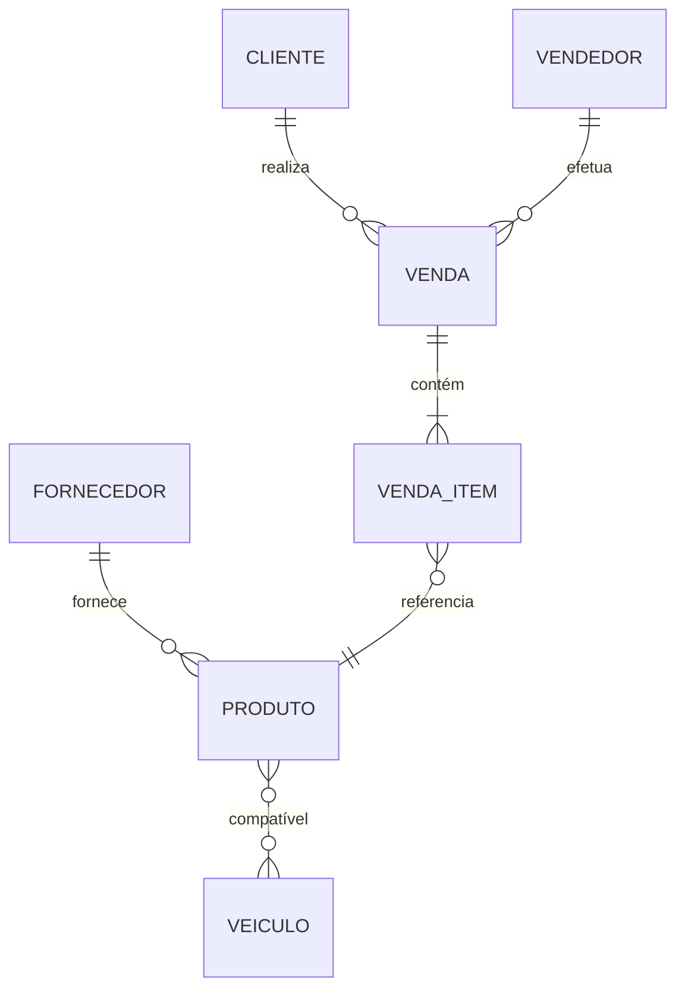

# AutoPeças API

API para gerenciamento de loja de autopeças desenvolvida com .NET 9, seguindo princípios de DDD, SOLID e Clean Code.

---

## 🛠 Tecnologias Utilizadas

- .NET 9
- PostgreSQL
- Entity Framework Core
- Swagger / OpenAPI
- DDD (Domain-Driven Design)
- SOLID Principles
- Clean Code

---

## 📋 Requisitos

- .NET 9 SDK
- PostgreSQL 15+

---

## 🚀 Como Executar

### ⚙️ Configuração Inicial

1. Clone o repositório:
   ```bash
   git clone https://github.com/seu-usuario/autopecas-api.git
   cd autopecas-api
   ```

2. Configure o banco de dados:

   Edite o arquivo `appsettings.json` com suas credenciais do PostgreSQL:

   ```json
   "ConnectionStrings": {
     "DefaultConnection": "Host=localhost;Port=5432;Database=AutoPecasDB;Username=postgres;Password=sua-senha"
   }
   ```

3. Execute as migrations:
   ```bash
   dotnet ef database update
   ```

### ▶️ Executando a API

```bash
dotnet run
```

A API estará disponível em:  
📍 https://localhost:7039  
Swagger UI:  
📍 https://localhost:7039/swagger

## 📊 Modelo de Dados



---

## 📝 Endpoints Principais

### 📦 Fornecedores

- `GET /api/Fornecedor` - Lista todos os fornecedores  
- `POST /api/Fornecedor` - Cadastra novo fornecedor  
- `GET /api/Fornecedor/{id}` - Obtém fornecedor por ID  
- `GET /api/Fornecedor/nome/{nome}` - Obtém fornecedor por Nome  
- `PUT /api/Fornecedor/{id}` - Atualiza fornecedor  
- `DELETE /api/Fornecedor/{id}` - Remove fornecedor

### 📦 Clientes

- `GET /api/Cliente` - Lista todos os clientes  
- `POST /api/Cliente` - Cadastra novo cliente  
- `GET /api/Cliente/{id}` - Obtém cliente por ID  
- `GET /api/Cliente/documento/{documento}` - Obtém cliente por Documento  
- `PUT /api/Cliente/{id}` - Atualiza cliente  
- `DELETE /api/Cliente/{id}` - Remove cliente

### 📦 Produtos

- `GET /api/Produto` - Lista todos os produtos  
- `POST /api/Produto` - Cadastra novo produto  
- `GET /api/Produto/{id}` - Obtém produto por ID  
- `PUT /api/Produto/{id}` - Atualiza produto  
- `DELETE /api/Produto/{id}` - Remove produto  

### 📦 Vendedores

- `GET /api/Vendedor` - Lista todos os vendedores  
- `POST /api/Vendedor` - Cadastra novo vendedor  
- `GET /api/Vendedor/{id}` - Obtém vendedor por ID  
- `GET /api/Vendedor/email/{email}` - Obtém vendedor por E-mail  
- `PUT /api/Vendedor/{id}` - Atualiza vendedor  
- `DELETE /api/Vendedor/{id}` - Remove vendedor

### 📦 Veiculos

- `GET /api/Veiculo` - Lista todos os veiculos  
- `POST /api/Veiculo` - Cadastra novo veiculo  
- `GET /api/Veiculo/{id}` - Obtém veiculo por ID  
- `GET /api/Veiculo/nome/{nome}` - Obtém veiculo por Nome  
- `GET /api/Veiculo/marca/{marca}` - Obtém veiculo por Marca  
- `PUT /api/Veiculo/{id}` - Atualiza veiculo  
- `DELETE /api/Veiculo/{id}` - Remove veiculo

### 🛒 Vendas

- `POST /api/Venda` - Registra nova venda  
- `GET /api/Venda/{id}` - Obtém venda com itens  
- `GET /api/Venda/periodo?inicio={date}&fim={date}` - Lista vendas por período  

### 📦 Estoque

- `POST /api/Produto/{id}/estoque` - Atualiza estoque  
- `GET /api/EstoqueNotificacao` - Lista notificações de estoque baixo  

---

## 🔄 Fluxo de Trabalho

1. Cadastre fornecedores  
2. Cadastre veículos  
3. Cadastre produtos (vinculando a fornecedores e veículos)  
4. Cadastre clientes e vendedores  
5. Registre vendas  

---

## 🧪 JSONs de Exemplo

### Cadastro de Fornecedor

```json
{
  "nome": "Fornecedor Exemplo",
  "contato": "João Silva",
  "telefone": "(11) 9999-9999",
  "email": "contato@fornecedor.com"
}
```

### Cadastro de Produto

```json
{
  "nome": "Pastilha de Freio",
  "descricao": "Pastilha para veículos populares",
  "preco": 89.90,
  "quantidadeEstoque": 50,
  "quantidadeMinima": 10,
  "imagem": "pastilha.jpg",
  "idFornecedor": 1,
  "idsVeiculosCompativeis": [1, 2]
}
```

---

## 🛡 Validações

A API inclui validações para:

- Campos obrigatórios  
- Formatos (email, telefone)  
- Relacionamentos (IDs existentes)  
- Quantidades mínimas/máximas  

---

## 📈 Monitoramento

Endpoints de saúde da aplicação:

- `GET /health` - Status da API  
- `GET /health/database` - Status do banco de dados  

---

## 🤝 Contribuição

1. Faça um fork do projeto  
2. Crie uma branch para sua feature:  
   ```bash
   git checkout -b feature/awesome-feature
   ```
3. Commit suas mudanças:  
   ```bash
   git commit -m 'Add awesome feature'
   ```
4. Push para a branch:  
   ```bash
   git push origin feature/awesome-feature
   ```
5. Abra um Pull Request

---

## 📄 Licença

Este projeto está licenciado sob a MIT License - veja o arquivo [LICENSE](LICENSE) para mais detalhes.
